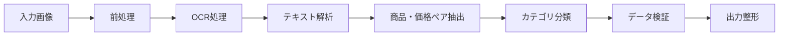

# チラシ商品価格抽出システム v2.0

広告チラシ画像（PDF/JPG/PNG）から商品名と価格情報を自動抽出し、構造化データ（CSV/JSON）として出力するシステムのプロトタイプ開発プロジェクトです。

## 🎯 プロジェクト目標

- **フェーズ 1（MVP）**: 商品名と価格の抽出に特化
- **目標精度**: 商品名・価格ペアの抽出精度 90%

## 🏗️ システムアーキテクチャ



## 🔧 技術スタック

### 必須要件

- **Python**: 3.10 以上
- **仮想環境**: uv（推奨）、Poetry、または venv
- **IDE**: Cursor（推奨）、VSCode

### 主要ライブラリ

- **画像処理**: OpenCV、Pillow
- **OCR**: Google Cloud Vision API、Azure Computer Vision API、Tesseract OCR
- **AI/LLM**: OpenAI GPT-4o、Anthropic Claude 3.5 Sonnet
- **データ処理**: pandas、numpy
- **テスト**: pytest、pytest-mock、pytest-cov
- **設定管理**: python-dotenv

## 🚀 セットアップ手順

### 1. リポジトリのクローン

```bash
git clone <repository-url>
cd chirashi_extraction
```

### 2. 仮想環境の作成・有効化

```bash
# uv使用（推奨）
uv venv
source .venv/bin/activate  # Windows: .venv\Scripts\activate

# または Poetry使用
poetry install
poetry shell

# または標準venv使用
python -m venv .venv
source .venv/bin/activate  # Windows: .venv\Scripts\activate
```

### 3. 依存関係のインストール

```bash
# uv使用
uv pip install -r requirements.txt

# または pip使用
pip install -r requirements.txt
```

### 4. 環境変数の設定

```bash
# .env.exampleをコピー
cp .env.example .env

# .envファイルを編集してAPIキーを設定
```

#### 必要な API キー

- **Google Cloud Vision API**: `GOOGLE_APPLICATION_CREDENTIALS`
- **OpenAI API**: `OPENAI_API_KEY`（または）
- **Anthropic API**: `ANTHROPIC_API_KEY`

## 📁 プロジェクト構造

```
chirashi_extraction/
├── src/                          # メインソースコード
│   ├── __init__.py
│   ├── preprocessing.py          # 画像前処理モジュール
│   ├── ocr_processor.py          # OCR処理モジュール
│   ├── extractor.py              # 商品・価格ペア抽出モジュール
│   ├── categorizer.py            # カテゴリ分類モジュール
│   ├── validator.py              # データ検証モジュール
│   ├── output_formatter.py       # 出力整形モジュール
│   ├── pipeline.py               # パイプライン統合モジュール
│   └── utils/                    # ユーティリティ
│       ├── __init__.py
│       ├── config.py
│       └── logger.py
├── tests/                        # テストコード
│   ├── unit/                     # 単体テスト
│   ├── integration/              # 統合テスト
│   └── fixtures/                 # テスト用データ
│       ├── sample_images/
│       └── expected_outputs/
├── docs/                         # ドキュメント
│   ├── spec/                     # 仕様書
│   └── images/                   # 画像資料
├── requirements.txt              # Python依存関係
├── .env.example                  # 環境変数テンプレート
├── .gitignore                    # Git除外ファイル
└── README.md                     # このファイル
```

## 🎮 使用方法

### 基本的な使用方法

```bash
# 単一画像の処理
python -m src.pipeline input_image.jpg --output result.json

# バッチ処理
python -m src.pipeline input_folder/ --batch --output results/

# CSV形式での出力
python -m src.pipeline input_image.jpg --output result.csv --format csv
```

### テストの実行

```bash
# 全テストの実行
pytest tests/ -v

# 単体テストのみ
pytest tests/unit/ --cov=src/

# 統合テストのみ
pytest tests/integration/ -v

# 特定モジュールのテスト
pytest tests/unit/test_preprocessing.py -v

# モック使用テスト
pytest tests/ --mock-apis
```

## 📊 入力・出力仕様

### 入力仕様

- **対応ファイル形式**: `.jpg`, `.jpeg`, `.png`, `.pdf`
- **ファイルサイズ上限**: 10MB
- **推奨解像度**: 300dpi 以上
- **レイアウト**: フリーレイアウト、グリッド型対応

### 出力仕様

#### CSV 形式

```csv
商品名,税込価格,税抜価格,単位,カテゴリ,信頼度
"きゅうり3本",198,180,"3本","食品",0.95
"サントリー天然水 2L",98,90,"1本","食品",0.92
```

#### JSON 形式

```json
[
  {
    "product": "きゅうり3本",
    "price_incl_tax": 198,
    "price_excl_tax": 180,
    "unit": "3本",
    "category": "食品",
    "confidence": 0.95
  }
]
```

## 📋 カテゴリ分類

対応カテゴリ:

- 食品
- 日用品
- 医薬品・化粧品
- 衣料品
- 家電・雑貨
- その他

## 🔧 開発ガイドライン

### TDD（テスト駆動開発）方針

1. 各モジュールごとに **先にテストコードを記述**
2. テストが失敗することを確認
3. テストを通すための最小実装を行う
4. テストが成功したら、必要に応じてリファクタリング

### パフォーマンス要件

- **目標処理時間**: 1 画像あたり 5 秒以内
- **バッチ処理**: 100 枚/時間

### セキュリティ要件

- API キーは環境変数で管理
- 個人情報を含むチラシは処理後即削除
- ログに機密情報を含めない

## 🐛 トラブルシューティング

### よくある問題

#### API キーエラー

```bash
# Google Cloud認証情報の確認
echo $GOOGLE_APPLICATION_CREDENTIALS

# OpenAI APIキーの確認
echo $OPENAI_API_KEY
```

#### 依存関係エラー

```bash
# 仮想環境の再作成
rm -rf .venv
uv venv
source .venv/bin/activate
uv pip install -r requirements.txt
```

#### OCR 精度が低い場合

- 画像解像度を 300dpi 以上に上げる
- 画像のコントラストを調整する
- ノイズ除去処理を強化する

## 📈 開発ロードマップ

### フェーズ 1: MVP（現在）

- [x] プロジェクト環境設定
- [ ] 画像前処理モジュール
- [ ] OCR 処理モジュール
- [ ] 商品・価格ペア抽出
- [ ] 基本的な出力機能

### フェーズ 2: 機能拡張（3 ヶ月後）

- [ ] 日付・曜日情報の抽出
- [ ] 中分類カテゴリの実装
- [ ] Web UI の実装（Streamlit/Gradio）

### フェーズ 3: 高度な機能（6 ヶ月後）

- [ ] 店舗名・地域情報の抽出
- [ ] チラシ有効期間の自動判定
- [ ] JAN コード連携による商品マスタ照合

## 📝 ライセンス

このプロジェクトは開発中のプロトタイプです。
